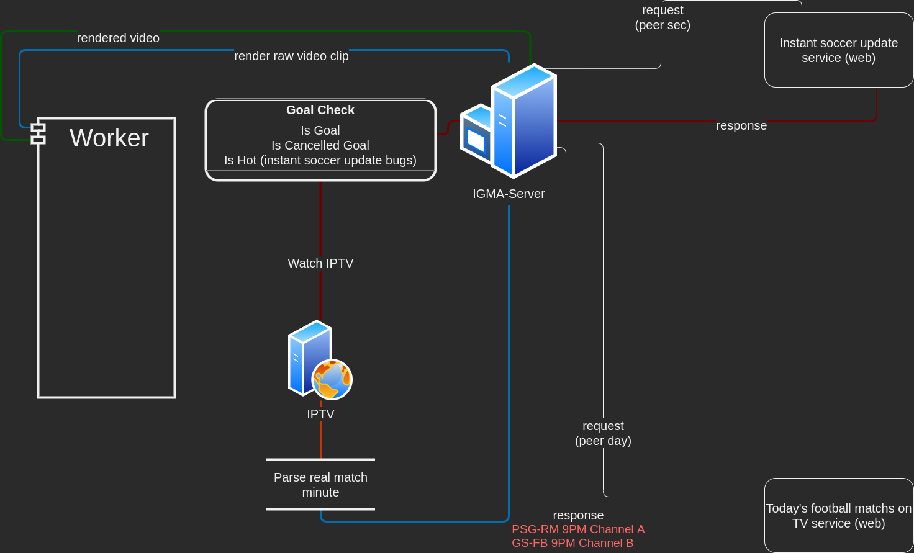

## IGMA-Server 
### IPTV Goal Monitor Automation SERVER -0.01-

##### -🇹🇷- Hakkında
Iptv futbol yayınlarını takip ederek gol kliplerini çıkartan 2 parçalı **kararsız** yazılım.

###### 3. parti bağımlılıklar
* ffmpeg (subprocess)
* ffprobe (subprocess)
* sox (subprocess)
* [365scores.com](https://365scores.com/)
* [sporx.com](https://www.sporx.com)
* [ocr.space](https://ocr.space) (kullanım dışı)
* [sporekrani.com](https://www.sporekrani.com/) (kullanım dışı)
* [ajansspor.com](https://ajansspor.com/spor-ekrani) (kullanım dışı)

###### Eksikler
* Taslak algoritma
* Tekrarlanan kod satırları
* Yetersiz güvenlik önlemleri
* Yetersiz hata kontrolü
* Yetersiz loglama
* Kullanıcı dostu olmayan ayar yapısı

**!! Taslak proje**
#

##### -🇬🇧- About
2-piece **unstable** software that tracks Iptv football (only Turkish) broadcasts and extracts goal clips.

###### 3. party dependencies
* ffmpeg (subprocess)
* ffprobe (subprocess)
* sox (subprocess)
* [365scores.com](https://365scores.com/)
* [sporx.com](https://www.sporx.com)
* [ocr.space](https://ocr.space) (deprecated)
* [sporekrani.com](https://www.sporekrani.com/) (deprecated)
* [ajansspor.com](https://ajansspor.com/spor-ekrani) (deprecated)

###### Deficiencies
* Draft algortihm
* Repeated code lines
* Inadequate security measures
* Inadequate logging
* Unfriendly setting types

**!! Draft project**